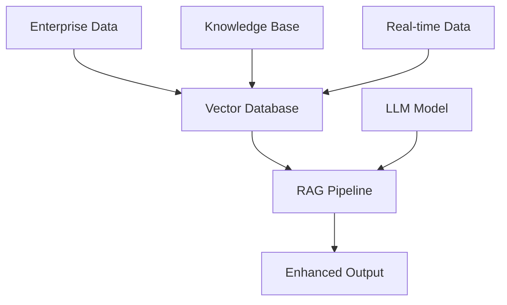
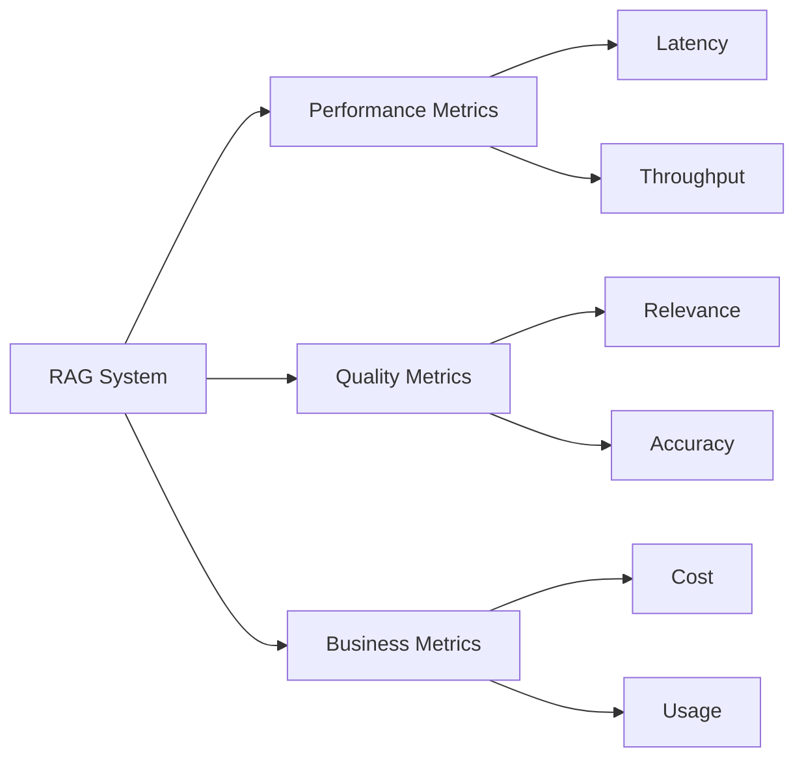

# Enterprise RAG Architecture: Building Scalable AI Systems in 2024

## Executive Summary
This article explores the architectural considerations for implementing Retrieval-Augmented Generation (RAG) in enterprise environments, with a focus on scalability and performance optimization.

## Current State of RAG Adoption
- RAG adoption has increased from 31% to 51% in enterprise deployments
- Becoming the dominant architecture for enterprise AI systems
- Key driver for customization without full model training



## Technical Architecture Components

### 1. Vector Database Layer
```python
from langchain.vectorstores import Chroma
from langchain.embeddings import OpenAIEmbeddings

def initialize_vector_store():
    embeddings = OpenAIEmbeddings()
    vector_store = Chroma(
        collection_name="enterprise_data",
        embedding_function=embeddings
    )
    return vector_store
```

### 2. Retrieval Pipeline
```python
from langchain.retrievers import ContextualCompressionRetriever
from langchain.retrievers.document_compressors import LLMChainExtractor

def create_retrieval_pipeline(vector_store):
    base_retriever = vector_store.as_retriever(
        search_type="similarity",
        search_kwargs={"k": 6}
    )
    compressor = LLMChainExtractor.from_llm(llm)
    compression_retriever = ContextualCompressionRetriever(
        base_compressor=compressor,
        base_retriever=base_retriever
    )
    return compression_retriever
```

## Performance Optimization
- Implementing caching strategies
- Batch processing for large-scale operations
- Query optimization techniques

## Security Considerations
- Data encryption at rest and in transit
- Access control and authentication
- Audit logging and monitoring

## Monitoring and Metrics


## Implementation Roadmap
1. Infrastructure Setup
2. Data Pipeline Development
3. Integration Testing
4. Performance Optimization
5. Security Hardening
6. Production Deployment

## Conclusion
RAG architecture has become the cornerstone of enterprise AI implementations, offering a balance of performance, customization, and maintainability.

## References
- Enterprise AI Survey 2024
- Technical Implementation Guidelines
- Security Best Practices Documentation