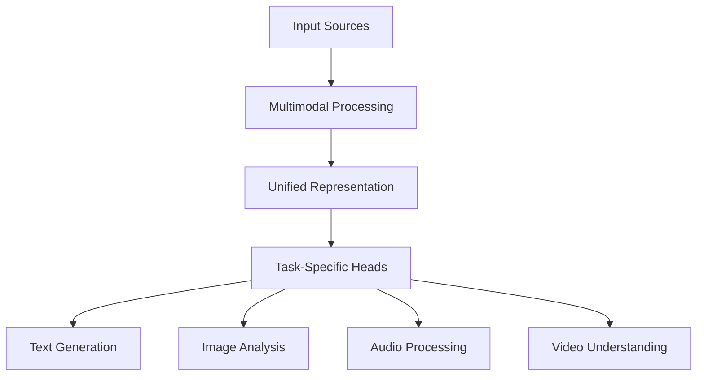
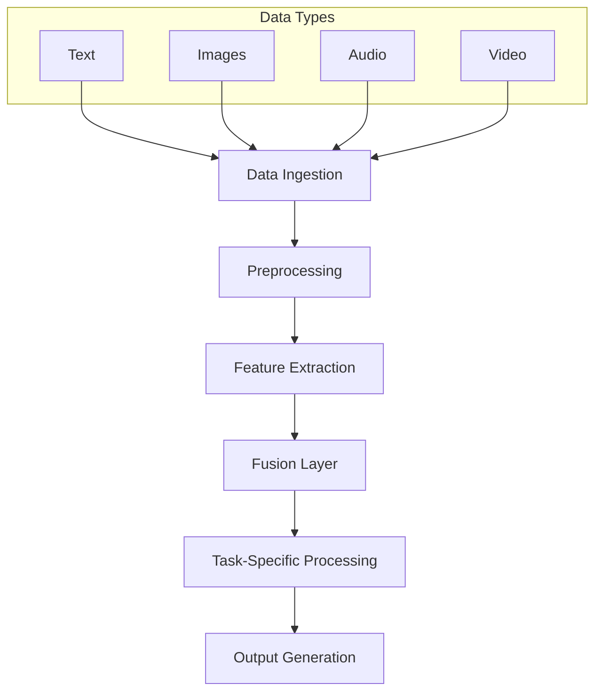
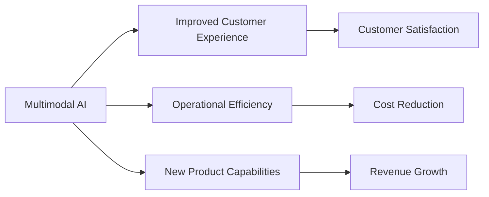

# Multimodal AI Systems: The Next Frontier in Enterprise Applications

## Executive Summary
This article explores the emergence of multimodal AI systems that can process and generate multiple types of data (text, images, audio, video) and their implications for enterprise applications.

## The Rise of Multimodal AI
- Integration of multiple data types in single models
- Enhanced understanding and generation capabilities
- Broader application scope in enterprise scenarios



## Technical Implementation

### 1. Multimodal Embeddings
```python
from transformers import CLIPProcessor, CLIPModel

def create_multimodal_embeddings():
    model = CLIPModel.from_pretrained("openai/clip-vit-base-patch32")
    processor = CLIPProcessor.from_pretrained("openai/clip-vit-base-patch32")
    
    return model, processor
```

### 2. Unified Processing Pipeline
```python
class MultimodalPipeline:
    def __init__(self, model, processor):
        self.model = model
        self.processor = processor
    
    def process_inputs(self, text=None, image=None, audio=None):
        embeddings = {}
        if text:
            embeddings['text'] = self.process_text(text)
        if image:
            embeddings['image'] = self.process_image(image)
        if audio:
            embeddings['audio'] = self.process_audio(audio)
        return self.combine_embeddings(embeddings)
```

## Architecture Considerations

### System Components


## Performance Optimization
1. Efficient Data Loading
2. Batch Processing
3. Model Quantization
4. Hardware Acceleration

## Enterprise Integration Patterns
- Microservices Architecture
- Event-Driven Processing
- Scalable Storage Solutions

## Security and Compliance
- Data Privacy Considerations
- Model Security
- Regulatory Compliance

## Implementation Strategy
1. Pilot Project Selection
2. Infrastructure Setup
3. Model Integration
4. Testing and Validation
5. Production Deployment
6. Monitoring and Optimization

## Business Impact Analysis


## Conclusion
Multimodal AI represents a significant advancement in enterprise AI capabilities, enabling more sophisticated and comprehensive applications.

## References
- Research Papers on Multimodal AI
- Enterprise Implementation Case Studies
- Technical Architecture Guidelines