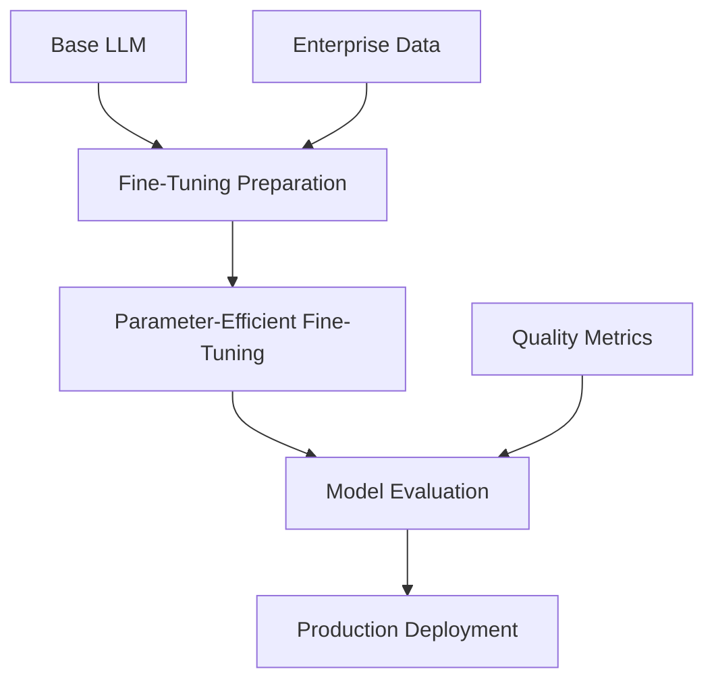
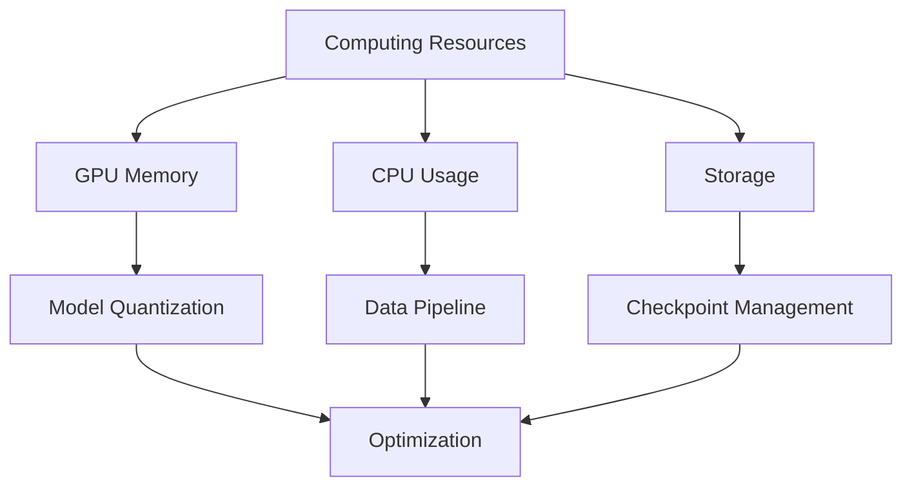
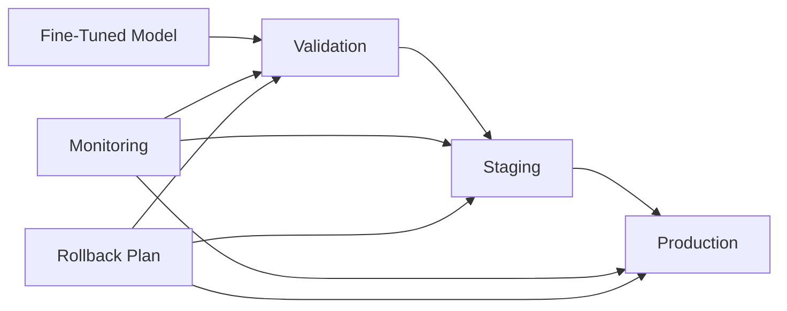

# Enterprise LLM Fine-Tuning Strategies: Optimization and Best Practices

## Executive Summary
This article explores effective strategies for fine-tuning Large Language Models (LLMs) in enterprise environments, focusing on optimization techniques and resource management.

## Current Landscape
- Shift from full model training to efficient fine-tuning
- Emergence of parameter-efficient techniques
- Balance between performance and resource utilization



## Technical Implementation

### 1. LoRA (Low-Rank Adaptation)
```python
from peft import LoraConfig, get_peft_model

def create_lora_model(base_model):
    lora_config = LoraConfig(
        r=16,  # rank
        lora_alpha=32,
        target_modules=["q_proj", "v_proj"],
        lora_dropout=0.05,
        bias="none"
    )
    
    model = get_peft_model(base_model, lora_config)
    return model
```

### 2. QLoRA Implementation
```python
def setup_qlora_training():
    config = {
        "load_in_4bit": True,
        "bnb_4bit_compute_dtype": "float16",
        "bnb_4bit_quant_type": "nf4",
        "bnb_4bit_use_double_quant": True,
    }
    
    return BitsAndBytesConfig(**config)
```

## Optimization Strategies

### Resource Management


## Data Preparation Pipeline
1. Data Cleaning
2. Format Standardization
3. Quality Checks
4. Augmentation Strategies

## Training Configuration
```python
def training_configuration():
    return {
        "learning_rate": 2e-4,
        "batch_size": 128,
        "gradient_accumulation_steps": 4,
        "warmup_steps": 100,
        "max_steps": 1000,
        "evaluation_strategy": "steps",
        "eval_steps": 200,
    }
```

## Monitoring and Evaluation
- Loss Tracking
- Performance Metrics
- Resource Utilization
- Quality Assessments

## Production Deployment Strategy


## Cost-Benefit Analysis
1. Training Costs
2. Infrastructure Requirements
3. Performance Improvements
4. Business Impact

## Implementation Timeline
1. Initial Assessment
2. Data Preparation
3. Model Selection
4. Fine-Tuning Process
5. Evaluation
6. Deployment

## Best Practices
- Regular Model Evaluation
- Continuous Data Quality Checks
- Resource Optimization
- Performance Monitoring

## Conclusion
Effective fine-tuning strategies are crucial for successful enterprise AI deployments, requiring careful balance of performance, resources, and business needs.

## References
- Technical Documentation
- Research Papers
- Case Studies
- Best Practices Guidelines