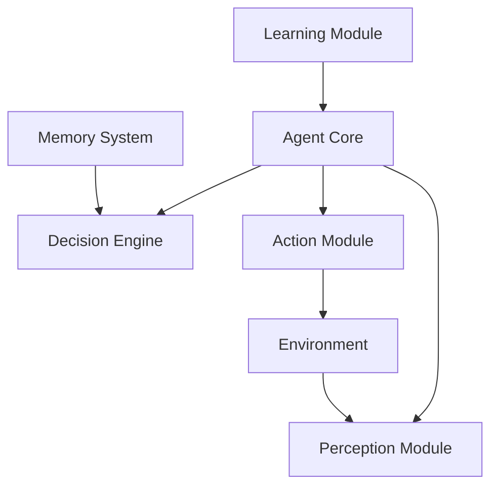
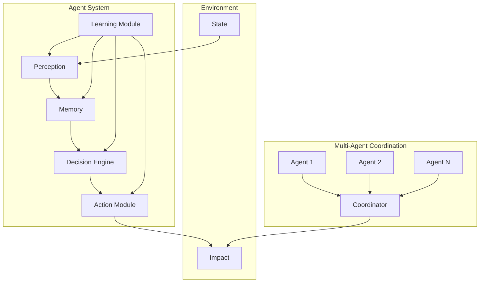
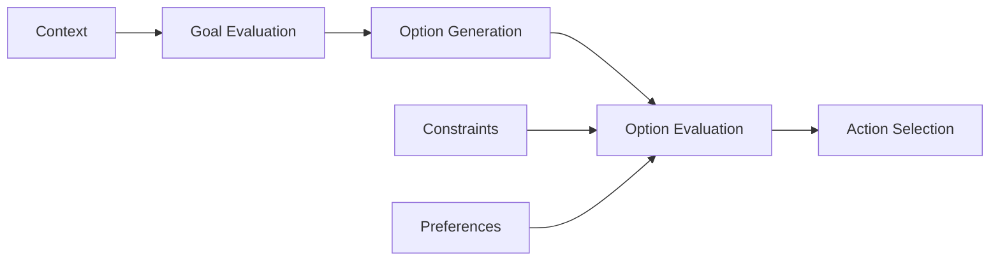
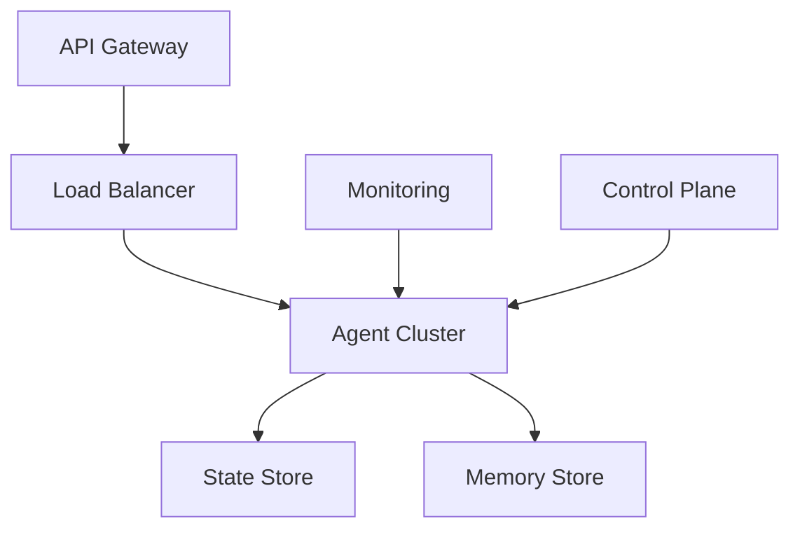

# Agentic AI Architecture: Building Autonomous AI Systems

## Executive Summary
This article explores the architecture and implementation of Agentic AI systems, focusing on autonomous decision-making, multi-agent coordination, and enterprise integration patterns.

## Understanding Agentic AI
- Autonomous decision-making capabilities
- Goal-oriented behavior
- Self-improvement and learning
- Multi-agent coordination



## Technical Implementation

### 1. Agent Core Architecture
```python
from typing import List, Dict
import numpy as np

class AgentCore:
    def __init__(self, config: Dict):
        self.perception = PerceptionModule(config['perception'])
        self.memory = MemorySystem(config['memory'])
        self.decision_engine = DecisionEngine(config['decision'])
        self.action_module = ActionModule(config['action'])
        self.learning_module = LearningModule(config['learning'])
        
    def process_cycle(self, environment_state):
        # Perception Phase
        observations = self.perception.process(environment_state)
        
        # Memory Integration
        self.memory.integrate(observations)
        
        # Decision Making
        decision = self.decision_engine.decide(
            self.memory.get_relevant_context()
        )
        
        # Action Execution
        action = self.action_module.execute(decision)
        
        # Learning and Adaptation
        self.learning_module.update(
            observations, decision, action
        )
        
        return action
```

### 2. Multi-Agent Coordination System
```python
class MultiAgentSystem:
    def __init__(self, num_agents: int):
        self.agents = [AgentCore(get_agent_config()) 
                      for _ in range(num_agents)]
        self.coordinator = CoordinationModule()
        
    def coordinate_actions(self, environment_state):
        individual_actions = []
        for agent in self.agents:
            action = agent.process_cycle(environment_state)
            individual_actions.append(action)
            
        coordinated_actions = self.coordinator.optimize(
            individual_actions
        )
        return coordinated_actions
```

## System Architecture

### Component Interaction


## Key Components

### 1. Perception Module
- Sensor data processing
- Environment state understanding
- Pattern recognition
- Uncertainty handling

### 2. Memory System
```python
class MemorySystem:
    def __init__(self, config):
        self.short_term = ShortTermMemory()
        self.long_term = LongTermMemory()
        self.working = WorkingMemory()
        
    def integrate(self, new_data):
        self.short_term.add(new_data)
        relevant_long_term = self.long_term.retrieve_relevant(
            new_data
        )
        self.working.update(new_data, relevant_long_term)
```

### 3. Decision Engine


## Implementation Considerations

### 1. Scalability
- Horizontal scaling of agent systems
- Resource management
- Load balancing
- State synchronization

### 2. Security
- Agent authentication
- Action validation
- System integrity
- Access control

### 3. Monitoring
```python
class AgentMonitoring:
    def __init__(self):
        self.metrics = MetricsCollector()
        self.logger = Logger()
        self.alerting = AlertSystem()
        
    def monitor_agent(self, agent_id, state, action):
        metrics = self.metrics.collect(agent_id, state, action)
        self.logger.log(metrics)
        if self.alerting.check_thresholds(metrics):
            self.alerting.send_alert(agent_id, metrics)
```

## Deployment Strategy

### Infrastructure Requirements


## Best Practices
1. Implement robust error handling
2. Design for failure
3. Enable graceful degradation
4. Maintain audit trails
5. Regular performance optimization

## Conclusion
Agentic AI represents a significant advancement in autonomous systems, requiring careful architecture and implementation considerations for enterprise deployment.

## References
- Autonomous Agent Design Patterns
- Multi-Agent Systems Research
- Enterprise Implementation Guidelines
- Security Best Practices