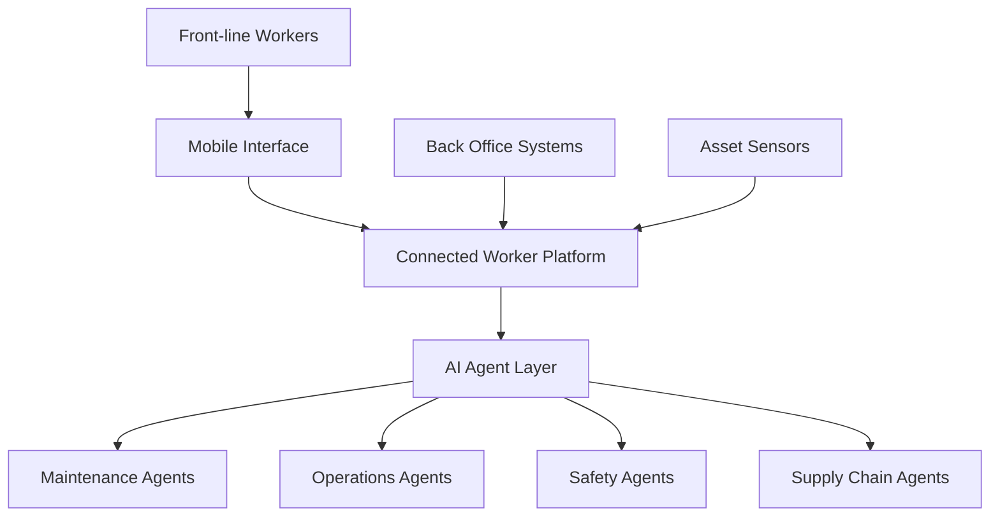
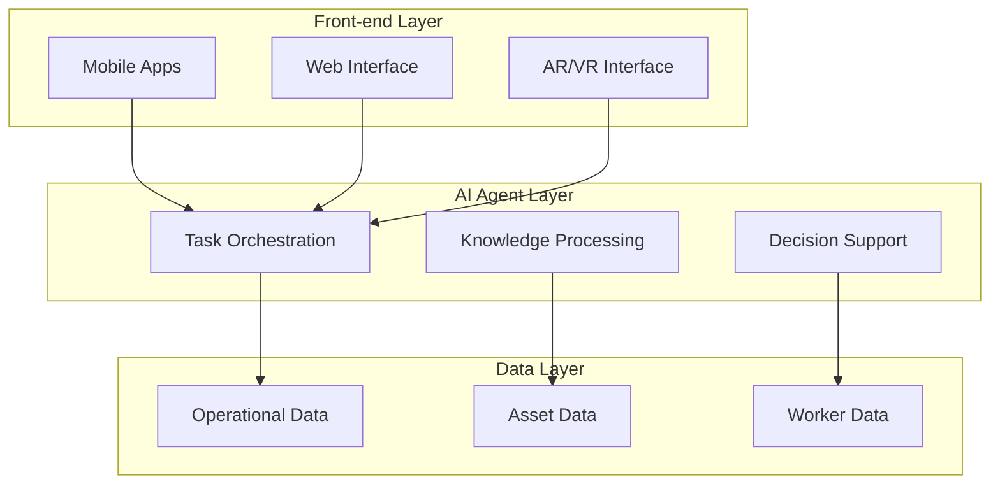
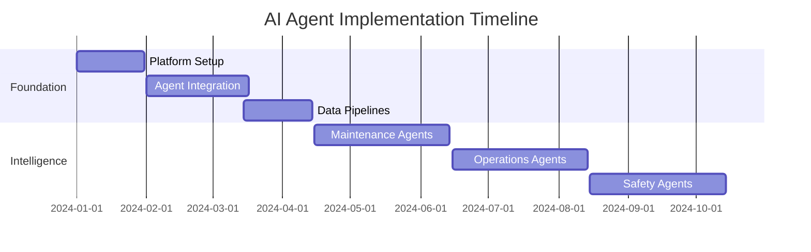
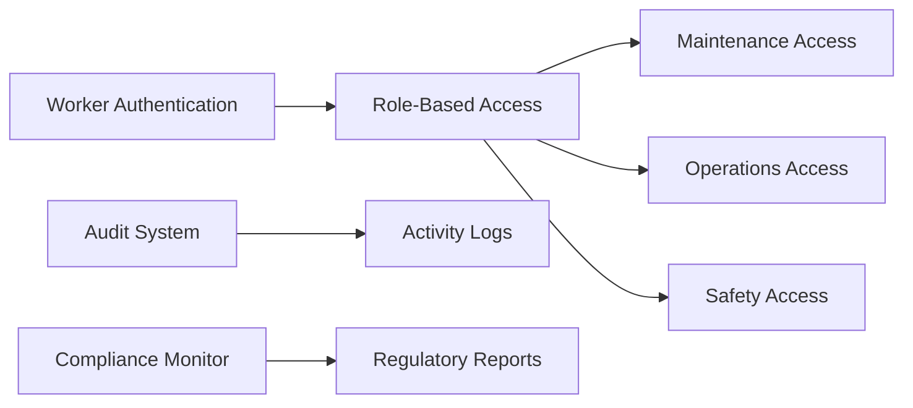
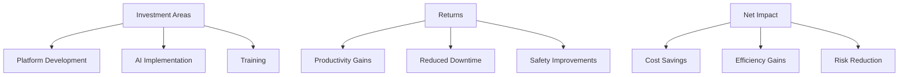

# AI Agents in Industrial Connected Worker Platforms: A Strategic Implementation Guide

## Executive Summary
This article provides a strategic roadmap for implementing AI agents and generative AI in industrial connected worker platforms, focusing on unifying operations, maintenance, and supply chain processes while enhancing front-line worker productivity and safety.

## Market Context
- Total Addressable Market: ~$10 billion
- Current Market Penetration: ~3%
- Key Growth Drivers: Digital transformation, worker safety, operational efficiency
- Primary Stakeholders: Front-line workers, back-office operations, asset management teams

## System Architecture Overview



## AI Agent Implementation Strategy

### 1. Maintenance Agent System
```python
class MaintenanceAgent:
    def __init__(self):
        self.llm = self._initialize_llm()
        self.knowledge_base = MaintenanceKnowledgeBase()
        self.sensor_interface = AssetSensorInterface()
        
    async def process_maintenance_request(self, request):
        # Get context from multiple sources
        sensor_data = await self.sensor_interface.get_current_readings()
        historical_data = await self.knowledge_base.get_relevant_history()
        
        # Generate maintenance plan
        plan = await self.llm.generate_maintenance_plan(
            request=request,
            sensor_data=sensor_data,
            historical_data=historical_data
        )
        
        return self._create_work_order(plan)
```

### 2. Operations Optimization Agents
```python
class OperationsAgent:
    def __init__(self):
        self.process_monitor = ProcessMonitor()
        self.workflow_optimizer = WorkflowOptimizer()
        self.resource_manager = ResourceManager()
    
    async def optimize_operations(self):
        current_state = await self.process_monitor.get_state()
        optimization_suggestions = (
            await self.workflow_optimizer.generate_suggestions(
                current_state
            )
        )
        return self._prioritize_actions(optimization_suggestions)
```

## Integration Architecture

### System Components


## Implementation Roadmap

### Phase 1: Foundation (3 months)
1. Core Platform Setup
2. Basic Agent Integration
3. Data Pipeline Establishment

### Phase 2: Intelligence Layer (6 months)


## Technical Components

### 1. Real-time Processing System
```python
class RealTimeProcessor:
    def __init__(self):
        self.stream_processor = StreamProcessor()
        self.alert_system = AlertSystem()
        
    async def process_sensor_data(self, sensor_data):
        processed_data = await self.stream_processor.process(
            sensor_data
        )
        if self._requires_attention(processed_data):
            await self.alert_system.notify_relevant_workers(
                processed_data
            )
```

### 2. Knowledge Graph Integration
```python
class IndustrialKnowledgeGraph:
    def __init__(self):
        self.graph_db = Neo4jDatabase()
        self.entity_extractor = EntityExtractor()
        
    async def update_knowledge(self, new_data):
        entities = self.entity_extractor.extract(new_data)
        relationships = self.entity_extractor.find_relationships(
            entities
        )
        await self.graph_db.update(entities, relationships)
```

## Security and Compliance

### Access Control System


## Performance Metrics

### Key Performance Indicators
1. Worker Productivity
2. Asset Uptime
3. Safety Incidents
4. Process Efficiency
5. Cost Savings

### Monitoring Dashboard
```python
class PerformanceMonitor:
    def __init__(self):
        self.metrics_collector = MetricsCollector()
        self.dashboard = RealTimeDashboard()
        
    async def update_metrics(self):
        metrics = await self.metrics_collector.get_current_metrics()
        analysis = self._analyze_trends(metrics)
        await self.dashboard.update(analysis)
```

## Business Impact Analysis

### ROI Calculation


## Conclusion
Implementing AI agents in industrial connected worker platforms represents a significant opportunity for digital transformation, with potential for substantial ROI through improved efficiency, safety, and operational excellence.

## References
- Industrial AI Implementation Guidelines
- Connected Worker Platform Standards
- Safety and Compliance Regulations
- Industry 4.0 Best Practices