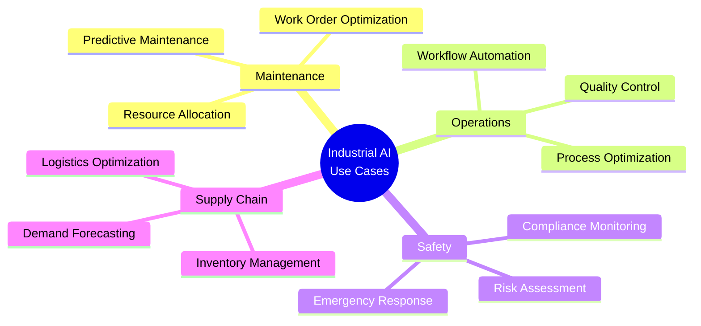
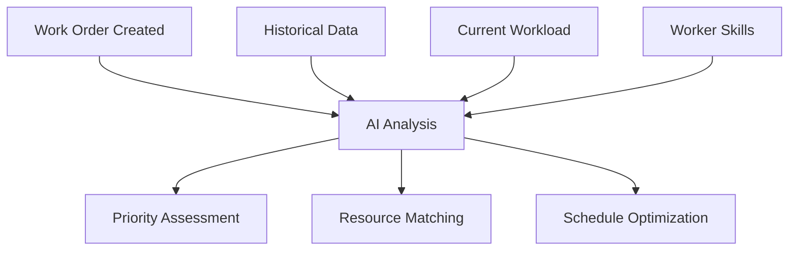
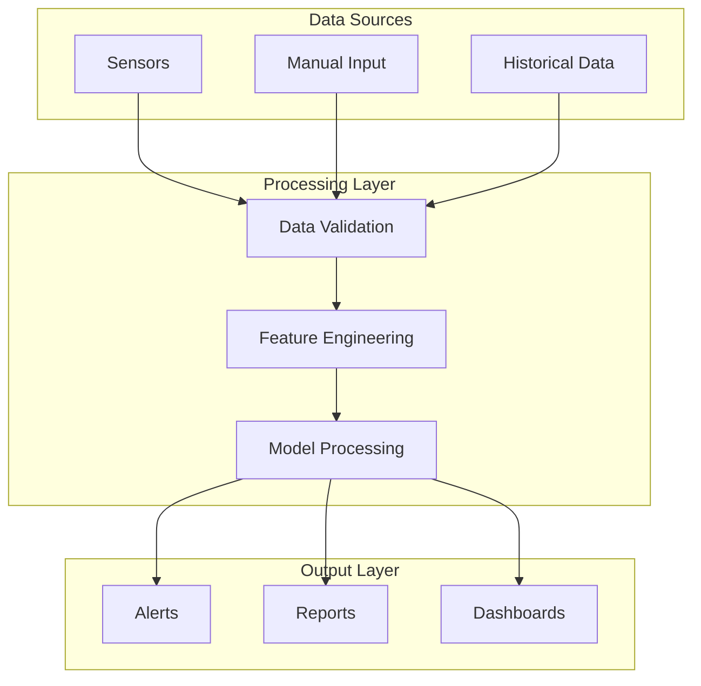
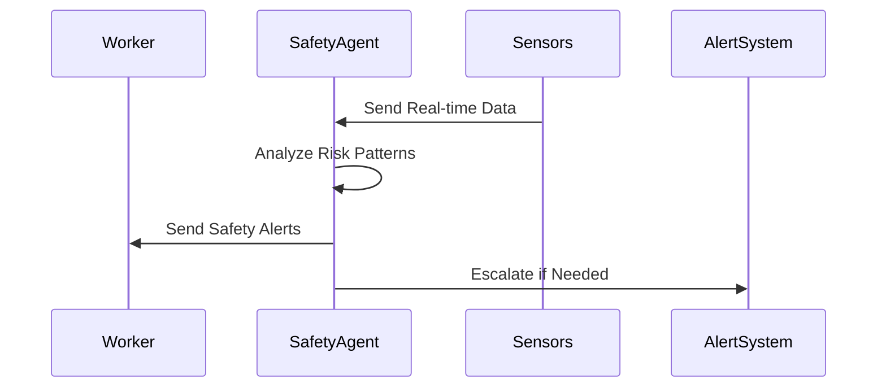
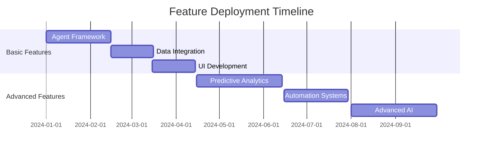
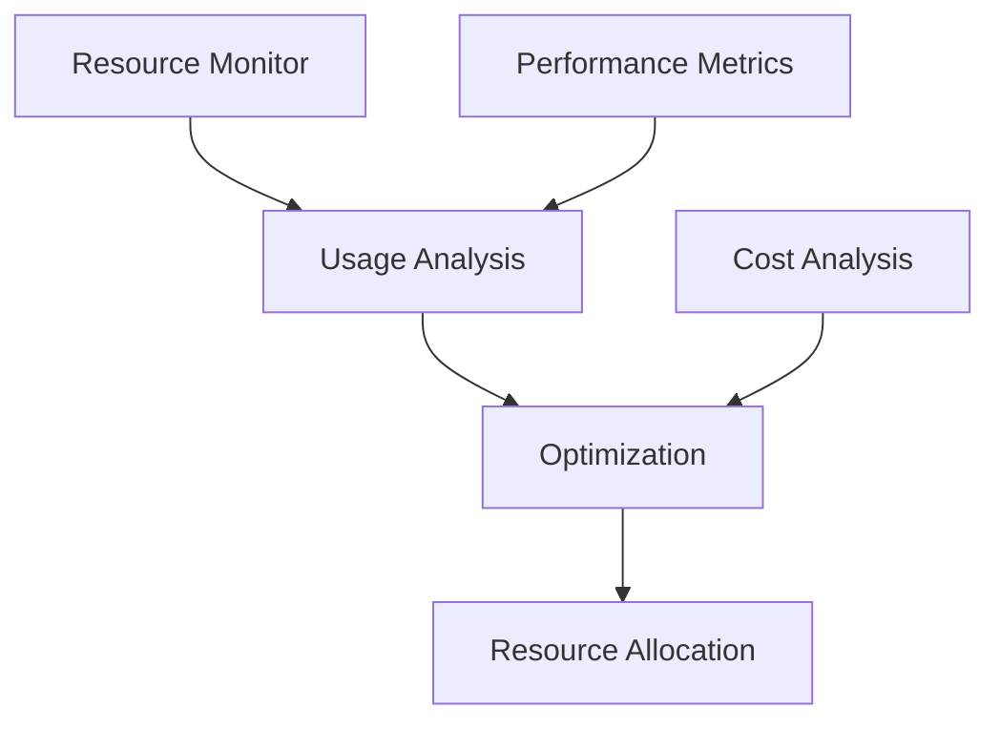

# Industrial AI Use Cases: Implementation Patterns for Connected Worker Platforms

## Executive Summary
This article details specific implementation patterns and use cases for AI agents in industrial connected worker platforms, focusing on practical applications that deliver immediate business value.

## Key Use Cases Matrix



## Implementation Patterns

### 1. Predictive Maintenance Agent
```python
class PredictiveMaintenanceAgent:
    def __init__(self):
        self.model = self._load_prediction_model()
        self.sensor_interface = SensorDataCollector()
        self.maintenance_scheduler = MaintenanceScheduler()
        
    async def predict_maintenance_needs(self):
        # Collect sensor data
        sensor_data = await self.sensor_interface.get_readings()
        
        # Generate predictions
        predictions = self.model.predict(sensor_data)
        
        # Schedule maintenance if needed
        if self._requires_maintenance(predictions):
            work_order = await self.maintenance_scheduler.create_work_order(
                asset_id=sensor_data.asset_id,
                predicted_issues=predictions.issues,
                priority=predictions.urgency
            )
            return work_order
```

### 2. Work Order Optimization


### 3. Quality Control System
```python
class QualityControlAgent:
    def __init__(self):
        self.vision_model = ComputerVisionModel()
        self.quality_standards = QualityStandards()
        self.notification_system = NotificationSystem()
        
    async def inspect_product(self, image_data):
        # Analyze product image
        analysis = await self.vision_model.analyze(image_data)
        
        # Check against quality standards
        compliance = self.quality_standards.check_compliance(
            analysis.measurements
        )
        
        if not compliance.meets_standards:
            await self.notification_system.alert_quality_team(
                compliance.issues
            )
        
        return compliance.report
```

## Integration Patterns

### 1. Data Flow Architecture


### 2. Worker Interaction System
```python
class WorkerInteractionSystem:
    def __init__(self):
        self.interface = MobileInterface()
        self.task_manager = TaskManager()
        self.knowledge_base = KnowledgeBase()
        
    async def handle_worker_request(self, request):
        # Process worker request
        intent = await self.interface.understand_intent(request)
        
        # Generate appropriate response
        if intent.type == "TASK_ASSISTANCE":
            response = await self.task_manager.get_guidance(
                task_id=intent.task_id
            )
        elif intent.type == "INFORMATION_REQUEST":
            response = await self.knowledge_base.get_information(
                query=intent.query
            )
            
        return self.interface.format_response(response)
```

## Implementation Examples

### 1. Safety Monitoring System


### 2. Supply Chain Optimization
```python
class SupplyChainAgent:
    def __init__(self):
        self.inventory_tracker = InventoryTracker()
        self.demand_predictor = DemandPredictor()
        self.order_manager = OrderManager()
        
    async def optimize_inventory(self):
        current_inventory = await self.inventory_tracker.get_levels()
        predicted_demand = await self.demand_predictor.forecast()
        
        optimization_plan = self._calculate_optimal_levels(
            current_inventory,
            predicted_demand
        )
        
        if optimization_plan.requires_action:
            await self.order_manager.create_orders(
                optimization_plan.orders
            )
```

## Deployment Strategy

### Phase 1: Core Functionality
1. Basic agent implementation
2. Data pipeline setup
3. User interface development

### Phase 2: Advanced Features


## Performance Optimization

### 1. System Monitoring
```python
class SystemMonitor:
    def __init__(self):
        self.metrics_collector = MetricsCollector()
        self.performance_analyzer = PerformanceAnalyzer()
        self.alert_system = AlertSystem()
        
    async def monitor_system(self):
        while True:
            metrics = await self.metrics_collector.collect()
            analysis = self.performance_analyzer.analyze(metrics)
            
            if analysis.requires_attention:
                await self.alert_system.notify_team(
                    analysis.issues
                )
```

### 2. Resource Management


## Conclusion
Successful implementation of AI agents in industrial settings requires careful consideration of use cases, integration patterns, and deployment strategies. The outlined patterns provide a framework for building robust, scalable solutions.

## References
- Industrial AI Best Practices
- Connected Worker Platform Documentation
- Implementation Case Studies
- Technical Architecture Guidelines