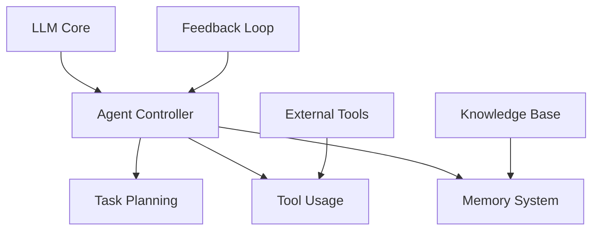
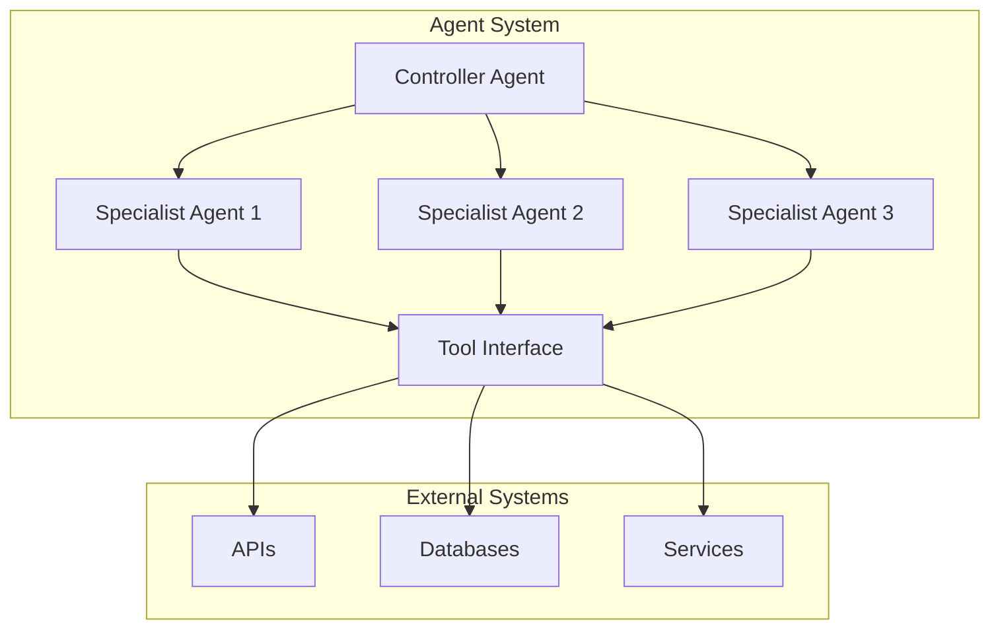
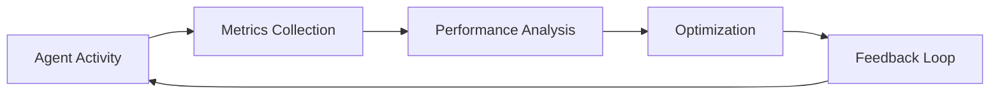

# Agentic AI Architecture: Building Autonomous Systems in 2024

## Executive Summary
This article explores the architectural patterns and implementation strategies for building autonomous AI agents, focusing on multi-agent systems and their enterprise applications.

## Current Landscape
- Emergence of autonomous agent frameworks
- Shift from passive to active AI systems
- Integration with existing enterprise infrastructure



## Technical Implementation

### 1. Agent Configuration with AutoGen
```python
from autogen import AssistantAgent, UserProxyAgent

def create_agent_system():
    # Create an assistant agent
    assistant = AssistantAgent(
        name="coding_assistant",
        llm_config={
            "model": "gpt-4",
            "temperature": 0.7,
            "config_list": config_list
        }
    )
    
    # Create a user proxy agent
    user_proxy = UserProxyAgent(
        name="user_proxy",
        human_input_mode="NEVER",
        max_consecutive_auto_reply=10
    )
    
    return assistant, user_proxy
```

### 2. Multi-Agent Communication
```python
from crewai import Agent, Task, Crew

def setup_agent_crew():
    # Create specialized agents
    researcher = Agent(
        role="Researcher",
        goal="Conduct comprehensive research on given topics",
        backstory="Expert at gathering and analyzing information",
        tools=[SearchTool(), AnalysisTool()]
    )
    
    analyst = Agent(
        role="Analyst",
        goal="Analyze and synthesize research findings",
        backstory="Expert at drawing insights from data",
        tools=[AnalysisTool(), ReportingTool()]
    )
    
    # Create crew
    crew = Crew(
        agents=[researcher, analyst],
        tasks=[research_task, analysis_task],
        workflow="sequential"
    )
    
    return crew
```

## System Architecture

### Component Interaction


## Key Features

### 1. Autonomous Decision Making
- Goal-oriented planning
- Dynamic task prioritization
- Self-correction mechanisms

### 2. Tool Creation and Usage
```python
class ToolManager:
    def __init__(self):
        self.available_tools = {}
    
    def create_tool(self, task_requirements):
        """Dynamically create new tools based on requirements"""
        tool_code = self.generate_tool_code(task_requirements)
        tool = self.compile_and_load_tool(tool_code)
        return tool
    
    def evaluate_tool_effectiveness(self, tool, metrics):
        """Evaluate and optimize tool performance"""
        performance_data = self.collect_metrics(tool, metrics)
        return self.optimize_tool(tool, performance_data)
```

## Performance Monitoring


## Security Considerations
1. Agent Boundaries
2. Access Control
3. Action Validation
4. Audit Logging

## Implementation Strategy
1. Framework Selection
2. Agent Design
3. Integration Planning
4. Testing and Validation
5. Deployment
6. Monitoring

## Best Practices
- Clear Agent Responsibilities
- Robust Error Handling
- Scalable Architecture
- Comprehensive Monitoring

## Future Developments
- Enhanced Autonomy
- Improved Collaboration
- Advanced Learning Capabilities

## Conclusion
Agentic AI represents a paradigm shift in enterprise AI, enabling truly autonomous systems capable of complex decision-making and task execution.

## References
- AutoGen Documentation
- CrewAI Framework Guide
- Enterprise Implementation Cases
- Research Papers on Multi-Agent Systems