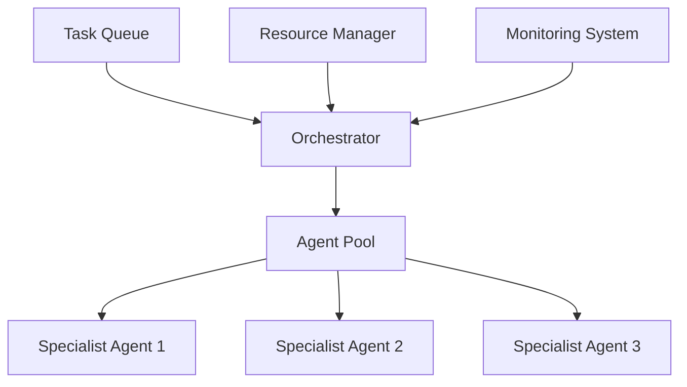
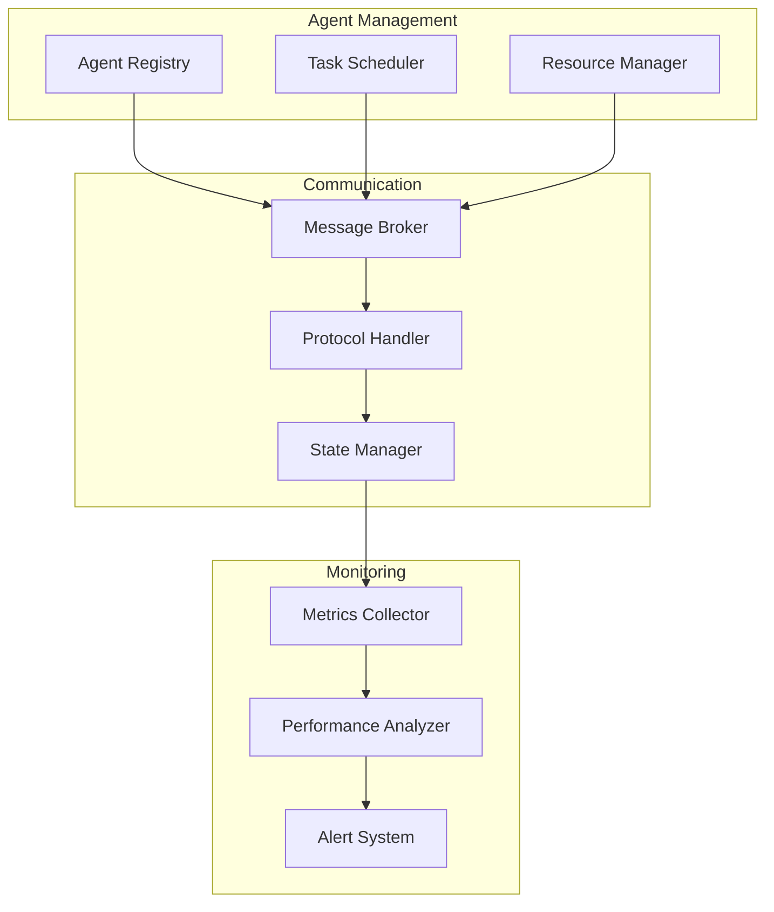
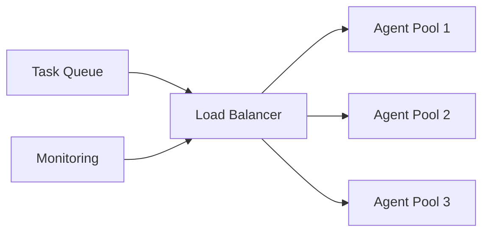
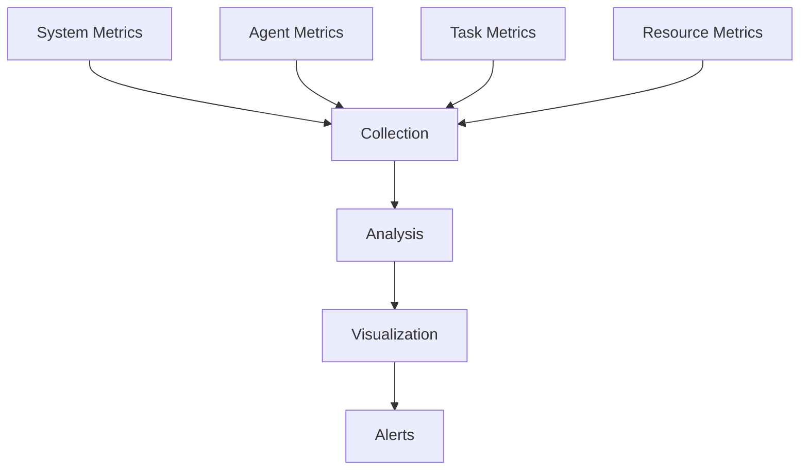

# Enterprise Multi-Agent Systems: Architectures and Implementation Patterns

## Executive Summary
This article explores the design and implementation of multi-agent systems in enterprise environments, focusing on collaboration patterns, communication protocols, and orchestration strategies.

## Current State of Multi-Agent Systems
- Evolution from single to multi-agent architectures
- Framework maturity and adoption
- Integration with enterprise systems



## Technical Implementation

### 1. Agent Orchestration with CrewAI
```python
from crewai import Task, Agent, Crew, Process

def create_specialist_agents():
    researcher = Agent(
        role="Research Specialist",
        goal="Gather and analyze information",
        backstory="Expert at information synthesis",
        tools=[SearchTool(), AnalysisTool()]
    )
    
    writer = Agent(
        role="Content Writer",
        goal="Create comprehensive reports",
        backstory="Expert at technical writing",
        tools=[WritingTool(), EditingTool()]
    )
    
    reviewer = Agent(
        role="Quality Reviewer",
        goal="Ensure output quality",
        backstory="Expert at quality assurance",
        tools=[QATool(), FeedbackTool()]
    )
    
    return [researcher, writer, reviewer]

def create_tasks():
    research_task = Task(
        description="Conduct comprehensive research",
        agent=researcher,
        expected_output="Research findings report"
    )
    
    writing_task = Task(
        description="Create technical documentation",
        agent=writer,
        expected_output="Technical document"
    )
    
    review_task = Task(
        description="Review and provide feedback",
        agent=reviewer,
        expected_output="Review report"
    )
    
    return [research_task, writing_task, review_task]
```

### 2. Communication Protocol
```python
class AgentCommunication:
    def __init__(self):
        self.message_queue = Queue()
        self.active_agents = {}
    
    async def broadcast_message(self, sender, message, recipients=None):
        """Send message to specific or all agents"""
        if recipients is None:
            recipients = self.active_agents.keys()
        
        for recipient in recipients:
            await self.send_message(sender, recipient, message)
    
    async def handle_response(self, sender, recipient, message):
        """Process and route agent responses"""
        response = await self.process_message(message)
        await self.update_agent_state(sender, recipient, response)
```

## Architecture Patterns

### System Components


## Performance Optimization

### 1. Resource Management
```python
class ResourceManager:
    def __init__(self):
        self.resource_pool = {}
        self.allocation_strategy = "priority"
    
    def allocate_resources(self, agent, requirements):
        """Allocate resources based on agent needs"""
        available = self.check_availability(requirements)
        if available:
            return self.assign_resources(agent, requirements)
        return self.queue_request(agent, requirements)
```

### 2. Load Balancing


## Implementation Strategy
1. Framework Selection
2. Agent Design
3. Communication Setup
4. Integration Planning
5. Testing
6. Deployment

## Best Practices
- Clear Agent Responsibilities
- Robust Error Handling
- Scalable Communication
- Comprehensive Monitoring

## Security Considerations
1. Agent Authentication
2. Message Encryption
3. Access Control
4. Audit Logging

## Monitoring and Metrics


## Future Developments
- Enhanced Collaboration
- Improved Learning
- Advanced Orchestration

## Conclusion
Multi-agent systems represent the future of enterprise AI, enabling complex task execution through coordinated agent collaboration.

## References
- CrewAI Documentation
- AutoGen Framework Guide
- Enterprise Case Studies
- Research Papers