# Strategic Implementation of AI Agents in Connected Worker Platforms: A Technical Roadmap for Industrial Digital Transformation

## Executive Summary
This article provides a strategic roadmap for implementing AI agents and generative AI in connected worker platforms, specifically focused on unifying operations, maintenance, and supply chain management in industrial settings.

## Current Market Analysis
- TAM of ~$10 billion with 97% untapped potential
- Critical shift from paper-based to digital processes
- Integration challenges between front-line and back-office operations


## Technical Architecture

### 1. AI Agent Implementation
```python
class IndustrialAgent:
    def __init__(self):
        self.llm = self._initialize_llm()
        self.knowledge_base = self._load_domain_knowledge()
        self.tools = self._initialize_tools()
    
    def _initialize_tools(self):
        return {
            'maintenance_scheduler': MaintenanceScheduler(),
            'inventory_manager': InventoryManager(),
            'safety_monitor': SafetyMonitor(),
            'workflow_optimizer': WorkflowOptimizer()
        }
    
    async def process_work_order(self, order_data):
        """Process and optimize work orders"""
        analysis = await self.analyze_requirements(order_data)
        schedule = await self.optimize_schedule(analysis)
        return self.generate_workflow(schedule)
```

### 2. Connected Worker Platform Components


## Implementation Strategy

### Phase 1: Foundation
1. Digital Infrastructure Setup
2. Data Collection & Integration
3. Basic Automation Implementation

### Phase 2: AI Integration
```python
class AIIntegrationManager:
    def __init__(self):
        self.agents = self._initialize_agents()
        self.workflows = self._load_workflows()
    
    def deploy_agent(self, process_type):
        """Deploy specialized AI agents for specific processes"""
        agent_config = self.get_agent_configuration(process_type)
        return self.agents.deploy(agent_config)
    
    def monitor_performance(self):
        """Track agent performance and optimize"""
        metrics = self.collect_performance_metrics()
        optimizations = self.analyze_and_optimize(metrics)
        return self.apply_optimizations(optimizations)
```

### Phase 3: Advanced Features


## Key Implementation Areas

### 1. Maintenance Optimization
```python
class MaintenanceOptimizer:
    def __init__(self):
        self.prediction_model = self._load_prediction_model()
        self.resource_manager = ResourceManager()
    
    async def optimize_maintenance_schedule(self, equipment_data):
        """Generate optimized maintenance schedules"""
        predictions = await self.predict_maintenance_needs(equipment_data)
        resources = await self.resource_manager.check_availability()
        return self.create_optimal_schedule(predictions, resources)
```

### 2. Operations Integration
- Real-time workflow optimization
- Dynamic resource allocation
- Performance monitoring
- Safety compliance

### 3. Supply Chain Management


## ROI Metrics
1. Operational Efficiency
2. Maintenance Cost Reduction
3. Safety Improvement
4. Worker Productivity
5. Asset Utilization

## Security and Compliance
```python
class SecurityManager:
    def __init__(self):
        self.access_control = AccessController()
        self.audit_logger = AuditLogger()
    
    def secure_operation(self, operation_data):
        """Ensure secure operation execution"""
        validated = self.validate_access(operation_data)
        if validated:
            self.audit_logger.log_operation(operation_data)
            return self.execute_operation(operation_data)
        return None
```

## Change Management Strategy
1. Stakeholder Engagement
2. Training Programs
3. Phased Implementation
4. Feedback Loops

## Future Roadmap

```mermaid
timeline
    title Technology Evolution Roadmap
    2024 : Basic Automation
         : Data Integration
         : Mobile Access
    2025 : AI Agents
         : Predictive Analytics
         : AR Integration
    2026 : Autonomous Operations
         : Advanced AI
         : Full Integration
```


## Recommendations for Implementation
1. Start with high-impact, low-complexity processes
2. Build robust data infrastructure
3. Focus on user experience
4. Implement strong security measures
5. Establish clear metrics for success

## Conclusion
The implementation of AI agents in connected worker platforms represents a significant opportunity for industrial digital transformation, with potential for substantial ROI through improved efficiency, safety, and operational excellence.

## References
- Industry 4.0 Standards
- AI Implementation Guidelines
- Industrial IoT Best Practices
- Connected Worker Case Studies